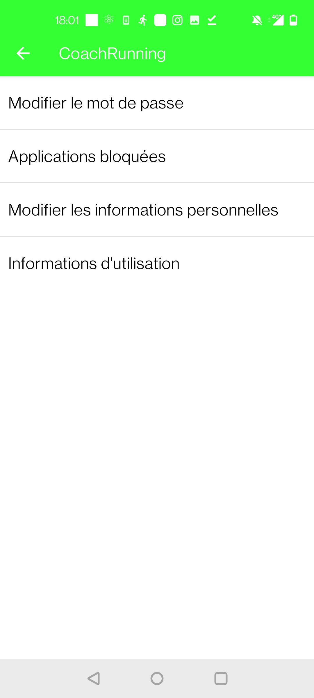

# coachrunning

An Android application designed to help people spending less time on their smartphone and do running instead. This project is my preparatory class project for the competitive exams of the CCINP. It is called Travail d’Initiative Personnelle Encadré (TIPE) in the French preparatory class academic system. It is my first ever programming project that I made with no particular knowledge in software engineering, it's not clean but it works (only on some Android versions though). 

  
  
  
  

## Features

The main feature of this project is to block desired applications on the smartphone when the user has not done enough physical activity. For this purpose, my application estimates calories spent when running or walking according to the gender, the height and the weight of the user. A password has to be set by the user, or preferably a friend of the user, in order to choose which applications will be blocked and the difficulty coefficient. When the user walk or run, a progress bar fills up accoring to the calories spent and the difficulty coefficient. If the user has not done enough physical activity, the chosen applications will be blocked until the progress bar is filled up again. 

## Technologies

Languages : Java, XML
IDE : Android Studio
Package management : Gradle 
